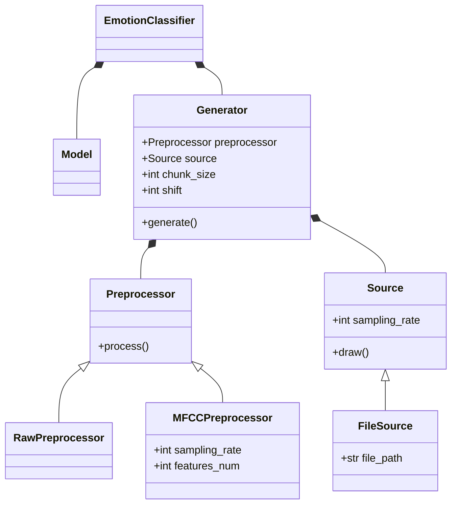

```mermaid
classDiagram
EmotionClassifier *-- Model

EmotionClassifier *-- Generator
class Generator {
    +Preprocessor preprocessor
    +Source source
    +int chunk_size
    +int shift
    +generate()
}

Generator *-- Preprocessor
class Preprocessor {
    +process()
}
Preprocessor <|-- RawPreprocessor
Preprocessor <|-- MFCCPreprocessor
class MFCCPreprocessor {
    +int sampling_rate
    +int features_num
}

Generator *-- Source
class Source {
    +int sampling_rate
    +draw()
}

Source <|-- FileSource
class FileSource {
    +str file_path
}
```
